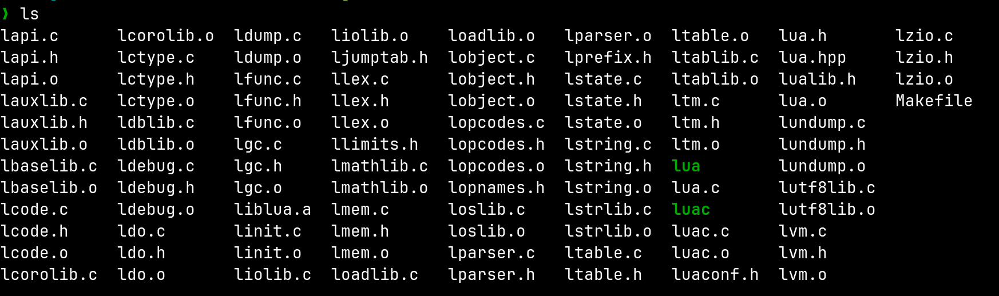

```toml
title = "The Lua Source Code"
tags = ["lua","compiler"]
date = 2025-04-20
```
here are some fun tidbits i found while skimming through the lua source code 
### type casting macros
lua has defined macros for type casting which make the code way cleaner and makes type casting way more usable  
dont know how common is this in codebases

```c
/* type casts (a macro highlights casts in the code) */
#define cast(t, exp)	((t)(exp))

#define cast_void(i)	cast(void, (i))
#define cast_voidp(i)	cast(void *, (i))
#define cast_num(i)	cast(lua_Number, (i))
#define cast_int(i)	cast(int, (i))
#define cast_uint(i)	cast(unsigned int, (i))
#define cast_byte(i)	cast(lu_byte, (i))
#define cast_uchar(i)	cast(unsigned char, (i))
#define cast_char(i)	cast(char, (i))
#define cast_charp(i)	cast(char *, (i))
#define cast_sizet(i)	cast(size_t, (i))
```


### other interesting macros
```c
/* macro to avoid warnings about unused variables */
#if !defined(UNUSED)
#define UNUSED(x)	((void)(x))
#endif
```

the directory structure is so easy to wrap my head around it is *flat!*

